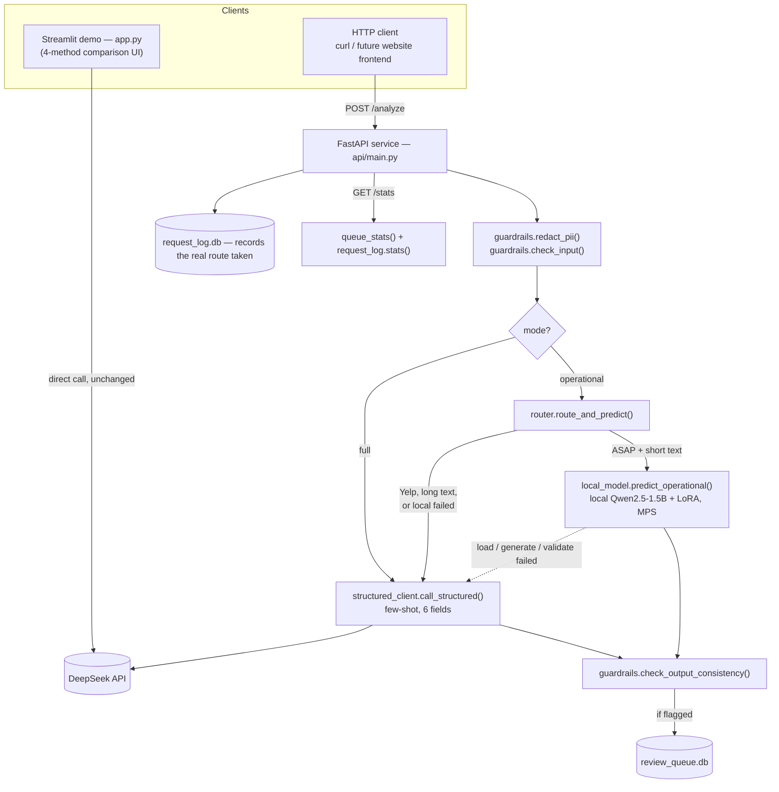

# Architecture

This doc covers the deployment shape added in Phase 4 (a FastAPI service, `api/main.py`, wrapping the engine and guardrails built in Phases 1-3 behind an HTTP API) and Phase 5 (model routing between that API and a real local fine-tuned model), plus the trade-offs behind the choices made in both.

## Model migration notes

DeepSeek retired the `deepseek-chat` model name in 2026; calls to it now return `400 invalid_request_error`. This surfaced while re-running the ASAP benchmark and briefly broke it in a specific, instructive way, worth recording rather than quietly papering over:

- **The model name is now centralized and overridable.** `src/config.py` sets `DEEPSEEK_MODEL` from an env var, defaulting to `deepseek-v4-flash` (the direct successor to `deepseek-chat`'s fast/cheap tier). Every call site reads it from there instead of hardcoding a string — `src/04_run_baselines_yelp.py` is the one exception (it predates the Phase 1 refactor and was never migrated onto `structured_client.py`, but it already imported `DEEPSEEK_MODEL` from config, so this fix applied to it for free).
- **`deepseek-v4-flash` is a reasoning model; `deepseek-chat` wasn't.** Reasoning tokens are generated before the answer and consume the same `max_tokens` budget. The old default (300, sized for a non-reasoning model) meant the entire budget was sometimes spent on reasoning, producing `finish_reason=length` with **empty content** — which looks exactly like "the model won't output JSON" and is easy to misdiagnose as a prompt problem. `structured_client.py`'s default is now 2000; `04_run_baselines_yelp.py`'s inline call was fixed the same way.
- **A real, unrelated bug this exposed:** the new model returns `aspect_sentiments` as a list of `{"aspect": ..., "sentiment": ...}` objects rather than the expected `{aspect: sentiment}` dict. `schema.py`'s coercion logic only handled list-of-string and dict shapes, so this raised an unhandled `TypeError` — and `structured_client.call_structured` only caught `pydantic.ValidationError`, so the exception propagated straight through and crashed the caller instead of being treated as an invalid-output-worth-a-repair-retry. Both are fixed: `schema.py` now normalizes several real-world shapes (see its docstring), and `call_structured` catches `Exception` generically at that point, on the principle that a validator hitting an unforeseen shape should degrade the same way a `ValidationError` does, not crash the process.
- **Practical effect on the numbers:** the ASAP benchmark table above was re-measured on `deepseek-v4-flash` and is modestly lower (F1 0.757→0.696) with roughly 4x the latency, which is a real, disclosed result of the model change — not a regression in this codebase. The Yelp table has not been re-measured yet and is flagged as such in the README.

**`app.py` and `api/main.py` are parallel, not connected.** This was a deliberate scope decision for Phase 4, not an oversight: `app.py` already worked and was fully tested at the end of Phase 3, and routing it through a new service would have meant risking a regression in the one artifact that's actually been exercised end-to-end (browser-tested across both datasets, real API calls, guardrail flows). The API is the "how would this actually get deployed" artifact; the Streamlit app remains the "interactive 4-method comparison" artifact. Both sit on the exact same engine layer (`src/schema.py`, `src/prompts.py`, `src/structured_client.py`, `src/guardrails.py`), so there's no logic duplicated between them — just two different front doors. Wiring the Streamlit app (or a real website frontend) through the API is the natural next step once this is actually running as a live service somewhere, not before.

## Why FastAPI

Typed request/response models (the `AnalyzeRequest`/`AnalyzeResponse` Pydantic models in `api/main.py`) give free request validation and an auto-generated OpenAPI spec (`/docs`) — for an API whose whole selling point is "structured output," having the API layer itself be schema-typed end to end is the consistent choice. Flask would need extra libraries (Marshmallow/Pydantic integration) to get the same thing; a serverless function (Lambda/Cloud Function) would work fine at this traffic level too, but a single small FastAPI service is easier to reason about locally and to containerize identically to the Streamlit app.

## Why SQLite (`review_queue.db`, `request_log.db`)

Both stores are single-writer, low-volume, and need to be trivially inspectable (`sqlite3 runtime/review_queue.db ".schema"`) for a demo/portfolio context — no separate database server to stand up, no connection pooling to configure. The concrete point where this stops being the right choice: **multiple API instances writing concurrently**. SQLite's file-level locking is fine for one process; the moment this runs as more than one replica (needed for real traffic or zero-downtime deploys), both tables would move to Postgres — the schema (see `src/review_queue.py` and `src/request_log.py`) is already just a couple of flat tables, so that migration is mechanical, not a redesign.

## Model routing (Phase 5)

`POST /analyze` with `mode="operational"` routes between the real local fine-tuned model (`src/local_model.py`, Qwen2.5-1.5B + the QLoRA adapter from `models/qwen-asap-qlora/final`, merged and run locally via `transformers`+`peft` on MPS/CPU) and the few-shot DeepSeek call (`structured_client.call_structured`), decided by `src/router.py`. Two real inputs drive the decision, not a fabricated confidence score:

1. **What the caller needs.** The local model was only ever trained to produce 3 fields (`problem_type`/`action_priority`/`operator_action`) on the ASAP profile — a `mode="full"` request or a Yelp-profile request is never eligible for the cheap path, because the small model literally can't answer it.
2. **Input length as a complexity proxy** (`router.LOCAL_MODEL_MAX_CHARS`). Short reviews stay on the cheap specialist — its documented accuracy (0.65 / 0.74 / 0.65, from `06_evaluate_finetuned.py`) is good enough for the easy majority. Longer, more complex reviews escalate to the few-shot call even when only the 3 operational fields were requested, on the theory that a harder review is more likely to need the bigger model's reasoning.

If the local path raises, fails to load, or its output doesn't validate, `router.py` falls back to the few-shot call rather than surfacing an error (`route="few_shot_fallback_local_failed"`) — a fast path that can fail has to degrade gracefully. Every route decision is a distinct, named label (`local_finetuned` / `few_shot_escalated_long_input` / `few_shot_non_asap_profile` / `few_shot_fallback_local_failed`) recorded in `request_log.db`'s `mode` column, not just a boolean — that's what makes "what % of ops-routing traffic actually got the cheap path" an answerable question later (Phase 6).

**This is machine-specific.** MPS (Apple Silicon GPU) acceleration is what makes local inference practical here (~14s per call once the base model is cached locally; ~2-5s is plausible on real GPU hardware). A real cloud deployment without Apple Silicon would either run this path on CPU (meaningfully slower, may no longer be "cheap" once latency is priced in) or would need an actual GPU instance — the same kind of infra trade-off Phase 4's "what changes at scale" section already flags, now made concrete by an actual measurement instead of a guess.

## Caching — not implemented, but where it'd go

This is the one gap most worth calling out, because it connects directly to the cost story already in the README: the fine-tuning break-even analysis (1,105 queries) assumes every query is unique, but in a real restaurant-ops setting, near-duplicate reviews are common ("etc same complaint, different customer"). A cache keyed on `hash(dataset, mode, normalized_text)` in front of `call_structured()` would cut real cost further than the fine-tuning story alone, especially at the high-volume end where fine-tuning is already recommended. Not implemented here because it needs a real decision about TTL/invalidation that isn't answerable without real traffic data — flagged as a next step, not silently skipped.

## Auth / rate limiting — not implemented

`api/main.py` has no authentication and no rate limiting. This is intentional for a local/demo deployment and is **not** something to fake with an in-app placeholder — in a real deployment this belongs at the gateway layer (API Gateway / nginx / Cloudflare in front of the service), not hand-rolled in application code. Noting the gap here is more honest than a decorative API-key check that doesn't reflect how this would actually be secured.

## What changes at 10x / 100x traffic

- **Synchronous request/response → async task queue.** Right now `POST /analyze` blocks on the DeepSeek call (~1-2s) or the local model call (~14s on this machine's MPS, first-token-inclusive). At real volume you'd accept the request, enqueue it (Celery/RQ/SQS), and let the client poll or use a webhook — the current shape is fine for a demo and for low-volume ops routing, not for bursty high-QPS traffic.
- **Model routing's length threshold becomes data-driven.** `router.LOCAL_MODEL_MAX_CHARS` is a reasonable starting heuristic, not a tuned one — with real traffic through `request_log.db`, you'd look at accuracy/flag-rate by route and adjust the threshold (or add a second signal) based on actual outcomes instead of a guess.
- **Local model serving moves off the API process.** Loading the merged model in-process (as `local_model.py` does now) is fine for one instance; at real replica counts you'd serve it from a dedicated inference process/endpoint so N API replicas share one loaded model instead of each loading its own copy.
- **SQLite → Postgres**, as above, once there's more than one API replica.
- **Real auth + rate limiting** at the gateway, as above, once this is actually internet-facing.

## File map

| Concern | File |
|---|---|
| HTTP API | `api/main.py` |
| Model routing decision | `src/router.py` |
| Local fine-tuned model inference | `src/local_model.py` |
| Request log (every call) | `src/request_log.py` → `runtime/request_log.db` |
| Flagged-item queue | `src/review_queue.py` → `runtime/review_queue.db` |
| Containerization | `Dockerfile.api`, `Dockerfile.streamlit`, `docker-compose.yml` |
| Engine (shared by both entry points) | `src/schema.py`, `src/prompts.py`, `src/structured_client.py`, `src/guardrails.py` |
